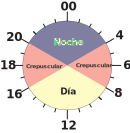

# Detectando actividad

Se intenta agregar una columna que marque el registro como nocturno/crepuscular/diurno, en base:

- Diurnos: Registros entre el final del amanecer y el inicio del atardecer
- Nocturnos: Entre el final del atardecer y el inicio del amanecer se consideraron registros nocturnos
- Crepuscular: Entre el inicio del atardecer y el final del atardecer, y entre el inicio y el final del amanecer.

El set de datos que voy a utilizar va a ser el mismo con el que se viene ejemplificando, notar que ya tiene la hora solar incluida.

```{r warning=FALSE, message=FALSE, echo=FALSE}
library(tidyverse)

horasolar <- function(datetime, longitude, timezone) {
  date_structure <- as.POSIXlt(as.POSIXct(datetime), tz = timezone)
  timezone_value <- date_structure$gmtoff / 3600
  
  N = yday(datetime) # Días del año.
  h = hour(datetime)
  mm = minute(datetime)
  ss = second(datetime)

  
  x=2*pi*(N-1-(h-12)/24)/365
  eqtime=229.18*(0.000075+0.001868*cos(x)-0.032077*sin(x)-0.014615*cos(2*x)-0.040849*sin(2*x))
  
  time_offset=eqtime-4*longitude+60*timezone_value
  tst=h*60+mm+ss/60-time_offset
  hours_ <- tst/60
  minutes_<- (hours_-floor(hours_))*60
  seconds_ = (minutes_ -floor(minutes_))*60
  # Para formatear
  hours_text <- abs(floor(hours_))
  minutes_text <- abs(floor(minutes_))
  seconds_text <- abs(floor(seconds_))
  
  
  
  hours_text <- ifelse(nchar(hours_text) < 2, paste0("0", hours_text), hours_text)
  minutes_text <- ifelse(nchar(minutes_text) < 2, paste0("0", minutes_text), minutes_text)
  seconds_text <- ifelse(nchar(seconds_text) < 2, paste0("0", seconds_text), seconds_text)
  resultado <- paste0(as.character(date(datetime)), " ",hours_text, ":", minutes_text, ":", seconds_text) %>% 
    as.POSIXct(., tz = timezone)
    
  return(resultado)
}

datos_camaras <- read.csv("datos/info_dispositivos.csv") %>%
  filter(tipo_dispositivo == "camera") %>% 
  select(sitio, camara = id_dispositivo, long, lat) %>% 
  filter(sitio == "CP") %>% 
  select(camara, long, lat)

load("datos/planilla_general.RData")

datos <- data %>% 
  filter(type == "Mammal" & site =="CP") %>% 
  select(sitio = site, sistema=station, camara = camera, datetime, grupo=group, sp=species) %>% 
  left_join(datos_camaras, by = join_by(camara)) %>% 
  mutate(hora_solar = horasolar(datetime=datetime, longitude=long, timezone="America/Montevideo")) %>% 
  select(sitio, sistema, camara, grupo, sp, datetime, hora_solar, long, lat)

paged_table(head(datos))
```

## Utilizando suncalc

Registros entre el final del amanecer y el inicio del atardecer

```{r warning=FALSE, message=FALSE}
library(suncalc)

######### IMPORTANTE DATOS ESTABAN EN UTC. ###########
datos$datetime <- force_tz(datos$datetime, tz="America/Montevideo")

# Ahora si obtengo sun_times

datos <- datos %>% 
  mutate(date = date(datetime)) %>% 
  rename(lon = long)

sun_times <- getSunlightTimes(data=datos, tz = "America/Montevideo")

# Amanecer
## Comienzo
datos$sunriseStart <- sun_times$sunrise
## Final
datos$sunriseEnd <- sun_times$sunriseEnd

# Atardecer
## Inicio
datos$sunsetStart <- sun_times$sunsetStart
## Final 
datos$sunsetEnd <- sun_times$dusk
```


```{r include=FALSE}
datos %>%
  select(camara, sp, datetime, hora_solar, sunriseStart, sunriseEnd, sunsetStart, sunsetEnd, lon, lat, sistema, sitio,grupo) %>% 
  paged_table()
```

Ahora se puede detectar si un registro es diurno, crepuscular o nocturno, siguiendo el método que hizo Cravino et al.

## Etapa del día según hora solar

La idea es poder identificar si un registro cae en alguna de las siguientes categorías, utilizando la hora solar:

<div style="text-align:center;">
  
</div>

```{r include=FALSE, warning=FALSE, message=FALSE}
datos <- datos %>% 
  select(camara, grupo, sp, datetime, hora_solar, lon, lat)
```

Los datos con los que se van a trabajar son los siguientes:

```{r echo=FALSE}
datos %>%
  head() %>% 
  paged_table()
```

Primero hay que transformar esa hora solar en valores de angulos en un circulo. Utilizando radianes.

### Hora solar a decimal y radianes

```{r}
# Calcula el valor decimal de la hora
datos <- datos %>% 
  mutate(hora_decimal = hour(hora_solar)+ minute(hora_solar)/60 + second(hora_solar)/3600, # Se extrae la hora en valores decimales.
         hora_radianes = hora_decimal * ((2 * pi)/24)) # También se almacena en radianes

plot(circular(prueba$hora_decimal), units = "hours", template="clock24")
plot(circular(prueba$hora_radianes), units = "radians")
```

Con esto se puede delimitar las categorias de nocturno, diruno y crepuscular facilmente:

```{r}
datos <- datos %>% 
  mutate(etapa_dia = if_else(hora_decimal <= 4 & hora_decimal >= 0 | hora_decimal >= 20, "Nocturno", 
                               if_else(hora_decimal >= 8 & hora_decimal <= 16, "Diurno", "Crepuscular")))
```

```{r echo=FALSE}
datos %>% 
  select(camara, sp, etapa_dia, hora_solar) %>% 
  paged_table()
```

```{r echo=FALSE}
save(datos, file="dato_generados_en_R/datos.RData")
```


## Jugando con los datos

Ahora, por ej., se puede calcular cuantos registros de axis son nocturnos, diurnos o crepusculares en Cabo Polonio.

```{r}
datos %>% 
  filter(sp == "Aaxi") %>% 
  group_by(etapa_dia) %>% 
  summarize("Cantidad de registros de Axis" = n())
```